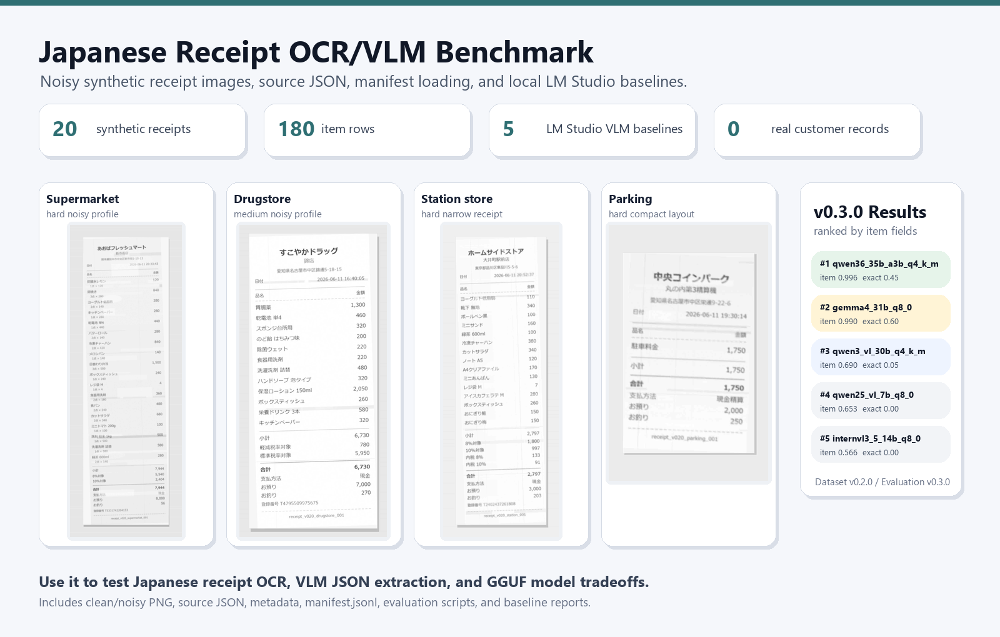

# Japan OCR Mini Benchmark

A compact Japanese receipt OCR/VLM benchmark with noisy synthetic receipt images, ground-truth JSON, and local LM Studio baseline results.



## Why This Exists

Most OCR examples stop at "can the model read the text?" This benchmark checks whether a model can recover structured Japanese receipt data:

- receipt-level fields: store, branch, address, date, time, payment, tax, total
- item-level fields: product name, quantity, unit price, line amount
- noisy camera-like inputs: print fading, local blur, banding, shadow, rotation, JPEG compression
- synthetic-only data: no real customer receipts, no personal information

It is intentionally small, inspectable, and easy to run locally. That makes it useful for fast OCR/VLM smoke tests before you spend time or money on larger evaluations.

## Current Releases

- **Dataset payload:** `v0.2.0`
- **Official LM Studio baseline:** `v0.3.0`
- **Leaderboard and scoring protocol:** `v0.3.1`
- **Canonical data root:** `release_v0.2.0/data/v0.2.0`
- **Official v0.3.0 reports:** `reports/v0.3.0`

<!-- JOMB_V030_LMSTUDIO_BASELINE_START -->
## v0.3.0 LM Studio 5-Model Baseline

The v0.3.0 release compares five local GGUF/VLM models through LM Studio's OpenAI-compatible API on the same 20 noisy receipt images.

### JOMB Core Score v1

`Core Score / 100 = Exact * 10 + Top-level * 25 + Item fields * 50 + Item count * 15`

The score is intentionally quality-only: runtime is reported separately, and item-field extraction receives the largest weight because line-item recovery is the main benchmark task.

### Result Snapshot

| Rank | Model | Core /100 | Quant | Avg sec | Exact | Top-level | Item fields | Item count |
| ---: | --- | ---: | --- | ---: | ---: | ---: | ---: | ---: |
| 1 | `gemma4_31b_q8_0` | 95.00 | `Q8_0` | 53.195 | 0.6 | 0.979545 | 0.990278 | 1 |
| 2 | `qwen36_35b_a3b_q4_k_m` | 93.61 | `Q4_K_M` | 4.282 | 0.45 | 0.972727 | 0.995833 | 1 |
| 3 | `qwen3_vl_30b_q4_k_m` | 73.59 | `Q4_K_M` | 3.248 | 0.05 | 0.943182 | 0.690278 | 1 |
| 4 | `qwen25_vl_7b_q8_0` | 70.99 | `Q8_0` | 5.094 | 0 | 0.934091 | 0.652778 | 1 |
| 5 | `internvl3_5_14b_q8_0` | 56.16 | `Q8_0` | 9.519 | 0 | 0.725 | 0.565672 | 0.65 |

Quick takeaways:

- `gemma4_31b_q8_0` has the best JOMB Core Score v1 and exact-match score, but is much slower.
- `qwen36_35b_a3b_q4_k_m` is the strongest item-level structured extraction baseline and the best speed/quality tradeoff among the top two.
- `qwen25_vl_7b_q8_0` is a useful lightweight speed baseline, but weak on unit-price extraction.

<!-- JOMB_V030_LMSTUDIO_BASELINE_END -->

<!-- JOMB_V031_LEADERBOARD_START -->
## Leaderboard and Scoring

v0.3.1 adds a reusable leaderboard and scoring protocol around `JOMB Core Score v1`.

- Leaderboard: `LEADERBOARD.md`
- Score protocol: `docs/evaluation/jomb_core_score_v1.md`
- Evaluate your own model: `docs/evaluation/submit_model_results.md`

Use this when you want to compare a new OCR/VLM run against the official v0.3.0 baselines.
<!-- JOMB_V031_LEADERBOARD_END -->

## What You Get

```text
release_v0.2.0/data/v0.2.0/
  manifest.jsonl
  source_json/
  metadata/
  degradation_metadata/
  images_clean/
  images_noisy/
reports/v0.3.0/
  v030_lmstudio_5model_summary.json
  v030_lmstudio_5model_summary.csv
  v030_lmstudio_5model_summary.md
  leaderboard.json
  leaderboard.csv
  leaderboard.md
docs/releases/v0.3.0.md
docs/releases/v0.3.1.md
LEADERBOARD.md
assets/jomb_v030_showcase.png
```

## Quick Start

List a few records from the manifest:

```powershell
python examples/load_v020_manifest.py --data-root "release_v0.2.0/data/v0.2.0" --limit 5 --show-paths
```

Evaluate your own prediction JSON files:

```powershell
python examples/evaluate_v020_baseline.py --data-root "release_v0.2.0/data/v0.2.0" --prediction-dir ".\model_outputs\my-model"
```

Read the manifest directly:

```python
from pathlib import Path
import json

data_root = Path("release_v0.2.0/data/v0.2.0")
manifest_path = data_root / "manifest.jsonl"

with manifest_path.open("r", encoding="utf-8") as f:
    first = json.loads(next(f))

print(first["document_id"])
print(data_root / first["noisy_image"])
print(data_root / first["source_json"])
```

## Template Coverage

| Template | Records | Noisy profiles |
| --- | ---: | --- |
| `bakery_simple` | 2 | medium=2 |
| `cafe_small_receipt` | 2 | medium=2 |
| `convenience_store_standard` | 3 | light=3 |
| `drugstore_mixed_tax` | 3 | medium=3 |
| `parking_machine` | 1 | hard=1 |
| `restaurant_receipt` | 2 | medium=2 |
| `station_store_narrow` | 4 | hard=4 |
| `supermarket_long` | 3 | hard=3 |

## Data Policy

All receipt images and JSON files are synthetic. Store names, branch names, addresses, invoice numbers, dates, products, prices, totals, and transaction details are artificial test data.

<!-- JOMB_V020_RELEASE_CANDIDATE_START -->
## v0.2.0 Dataset Payload

The v0.2.0 payload is the frozen public dataset release used by the v0.3.0 LM Studio baseline.

- Records: `20`
- Source JSON files: `20`
- Metadata JSON files: `20`
- Degradation metadata JSON files: `20`
- Clean PNG images: `20`
- Noisy PNG images: `20`
- Total item rows: `180`
- Noisy profile counts: `light=3`, `medium=9`, `hard=8`
- Frozen target run ID: `v020_target_20260613_221713`
- Data root: `release_v0.2.0/data/v0.2.0`
- Reports root: `reports/v0.2.0`

All receipt images and JSON files are synthetic. No real customer receipt data is included.
<!-- JOMB_V020_RELEASE_CANDIDATE_END -->


## Notes

Earlier 5-receipt sample materials are preserved at `legacy/initial_5_receipt_sample/`. For current work, start from `manifest.jsonl` in the v0.2.0 data root.
