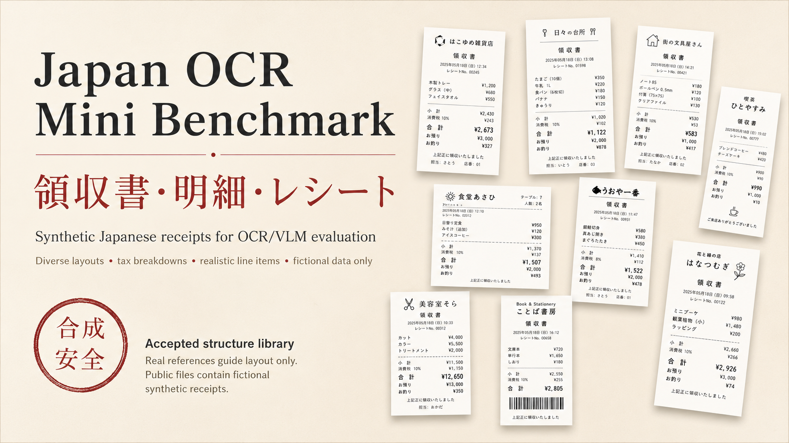

# Japan OCR Mini Benchmark



**Japan OCR Mini Benchmark** is a compact, local-first benchmark for testing whether OCR/VLM models can read Japanese receipts and return structured JSON.

It is not just a text-reading demo. It checks whether a model can recover receipt-level fields, item rows, taxes, totals, quantities, discounts, payment methods, and noisy camera-like variants.

> **領収書 / 明細 / 税 / 合計**  
> Synthetic Japanese receipts with fictional stores, dense line items, and model-ready ground truth.

## Latest Status

- **Latest public alpha payload:** `alpha10`
  - 10 approved synthetic Japanese receipt samples
  - clean images + public source JSON + public metadata
  - invoice_profile / phone_profile included
  - public safety scan: pass
  - license: CC BY 4.0
  - CASE-000048 excluded
- **Frozen core dataset payload:** `v0.2.0`
- **Current model benchmark:** `v0.4.0` Clean/Noisy LM Studio leaderboard
- **Current receipt-generation library:** `v0.4.2`
- **Accepted receipt design candidates:** `83`
- **Distinct semantic structures:** audit in progress
- **Selection review:** internal curator review, summarized in the v0.4.2 reference-generation summary file
- **Accepted design report:** the v0.4.2 reference-generation report folder

## Why This Exists

Most OCR examples stop at "can the model read the text?" Japanese receipts are meaner and more interesting:

- item names are short, dense, and often abbreviated
- tax categories can mix 8%, 10%, non-taxable, discounts, and coupons
- totals must agree with item rows
- noisy photos bend, blur, fade, crop, and shadow the paper
- local VLMs often produce plausible JSON that is subtly wrong

This project gives you a small but inspectable target for fast local testing before scaling to a bigger evaluation.

## What Is New In v0.4.2

`v0.4.2` turns the receipt-generation work into a curated design-candidate library.

- `83` accepted synthetic clean receipt design candidates
- the 83 candidates include semantic structures, layout variants, and branding/logo/typography variants
- audited distinct semantic structure count is still in progress
- Japanese logo-like store names, brush-style headers, seals, dense supermarket receipts, food service receipts, payment/point/coupon layouts, and specialty receipt formats
- accepted / hold / rewrite review workflow for future expansion
- public-safe fictional data policy retained
- real reference images are **not** copied into the public report


## Benchmark Releases

| Area | Version | What it contains |
| --- | --- | --- |
| Public alpha payload | `alpha10` | 10 human-approved synthetic Japanese receipt samples with clean images, public source JSON, metadata, invoice/phone profiles, and public safety scan pass |
| Dataset payload | `v0.2.0` | 20 synthetic Japanese receipts with clean/noisy images and ground-truth JSON |
| LM Studio baseline | `v0.3.0` | first local multi-model noisy-image benchmark |
| Operational snapshots | `v0.3.1`, `v0.3.2` | additional LM Studio runs and combined rankings |
| Clean/Noisy leaderboard | `v0.4.0` | paired clean and noisy benchmark tables |
| Generator QA | `v0.4.1` | audited 23-template clean receipt generator snapshot |
| Design-candidate library | `v0.4.2` | 83 accepted receipt designs for future taxonomy and 100-type generation |

## Alpha10 Approved Payload

`alpha10` is the first small public-approved payload produced from the receipt library workflow.

- 10 clean synthetic Japanese receipt images
- 10 public source JSON files
- 10 public metadata JSON files
- invoice_profile and phone_profile fields for structured evaluation
- public safety scan: pass
- CC BY 4.0 license confirmation for the Alpha10 approved payload
- human approval record retained in the publication workflow
- CASE-000048 excluded
- intended for OCR/VLM evaluation, not large-scale model training

The samples are synthetic. They do not include real receipt photos, real customer data, real transactions, or copied brand assets.

## Structure Selection Method

The generator now separates three ideas that used to be easy to mix up:

- **candidate:** a generated receipt design worth reviewing
- **distinct structure:** a receipt with meaningfully different fields, tax/accounting logic, payment behavior, service flow, or document topology
- **visual variant:** a layout, logo, store-name, brush-lettering, seal, font, or branding difference

The 100-type target means 100 audited distinct structures. It does not mean 100 images or 100 logo variants.

## Leaderboards

The current model leaderboard uses **JOMB Core Score v1**:

```text
Core Score =
Exact match       * 10%
+ Top-level fields * 25%
+ Item fields      * 50%
+ Item count       * 15%
```

Read the full ranking in:

- `LEADERBOARD.md`
- `reports/v0.4.0/clean_leaderboard.md`
- `reports/v0.4.0/noisy_leaderboard.md`
- `reports/v0.4.0/clean_noisy_paired_leaderboard.md`

## Repository Map

```text
alpha10/
  README.md
  LICENSE_NOTICE.md
  ALPHA10_LICENSE_FINAL_CONFIRMATION.md
  alpha10_manifest.json
  alpha10_manifest.csv
  alpha10_public_safety_scan.md
  images/
  source_json/
  metadata/

v0.4.2 reference-generation report folder/
  README.md
  index.html
  contact_sheet.png
  manifest.jsonl
  summary.json
  images_clean/
  metadata/
  thumbs/

reports/v0.4.0/
  clean_leaderboard.*
  noisy_leaderboard.*
  clean_noisy_paired_leaderboard.*

docs/releases/
  v0.4.0.md
  v0.4.1.md
  v0.4.2.md

assets/
  jomb_alpha10_readme_hero.png
  jomb_v042_receipt_wall.png
```

## Quick Start

Inspect the Alpha10 public payload manifest:

```powershell
python -m json.tool alpha10/alpha10_manifest.json
```

List records from the frozen dataset:

```powershell
python examples/load_v020_manifest.py --data-root "release_v0.2.0\data\v0.2.0" --limit 5 --show-paths
```

Evaluate your own prediction JSON files:

```powershell
python examples/evaluate_v020_baseline.py --data-root "release_v0.2.0\data\v0.2.0" --prediction-dir ".\model_outputs\my-model"
```

Open the v0.4.2 receipt structure gallery:

```text
the v0.4.2 reference-generation gallery HTML
```

## Data Policy

The public benchmark data is synthetic. Development references may be used to study receipt layout conventions, but public files must not include real customer receipt images, real personal information, copied brand logos, or local absolute paths.

For Alpha10:

- phone numbers and invoice registration numbers are synthetic or unverified OCR benchmark fields
- no live lookup was performed for phone numbers or registration numbers
- invoice_profile and phone_profile are included for structured evaluation
- real reference images are not included
- CASE-000048 is excluded

## License

The Alpha10 approved payload is released under CC BY 4.0.

This license confirmation applies to the Alpha10 approved payload. See:

- `alpha10/ALPHA10_LICENSE_FINAL_CONFIRMATION.md`
- `alpha10/LICENSE_NOTICE.md`

See `LICENSE.md` in the public payload when mirrored. This public repository contains release artifacts, evaluation scripts, leaderboards, and sanitized synthetic receipt-generation reports for the Japan OCR Mini Benchmark project.

