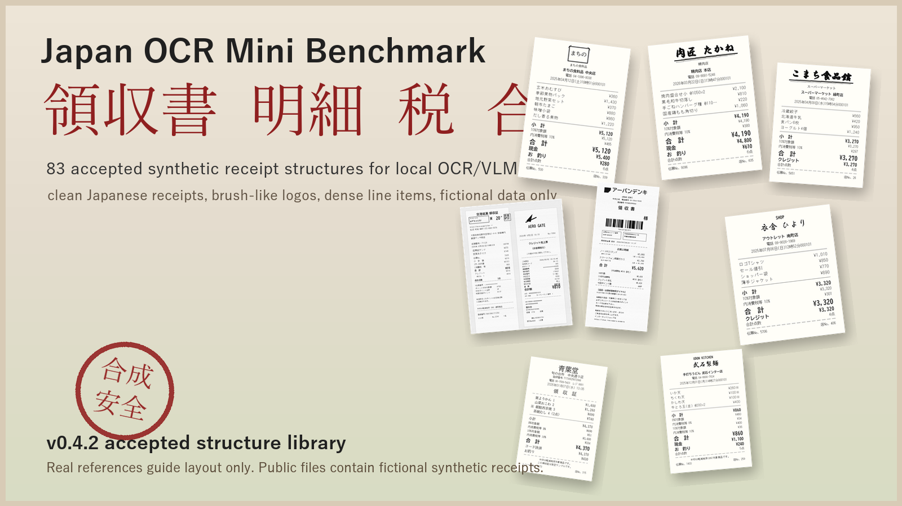
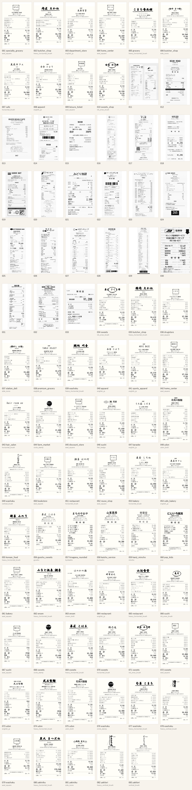

# Japan OCR Mini Benchmark



**Japan OCR Mini Benchmark** is a compact, local-first benchmark for testing whether OCR/VLM models can read Japanese receipts and return structured JSON.

It is not just a text-reading demo. It checks whether a model can recover receipt-level fields, item rows, taxes, totals, quantities, discounts, payment methods, and noisy camera-like variants.

> **領収書 / 明細 / 税 / 合計**  
> Synthetic Japanese receipts with fictional stores, dense line items, and model-ready ground truth.

## Latest Status

- **Current dataset payload:** `v0.2.0`
- **Current model benchmark:** `v0.4.0` Clean/Noisy LM Studio leaderboard
- **Current receipt-generation library:** `v0.4.2`
- **Accepted receipt structures:** `83`
- **Selection review:** internal curator review, summarized in `reports/reference_generation/v0.4.2/summary.json`
- **Accepted structure report:** `reports/reference_generation/v0.4.2`

## Why This Exists

Most OCR examples stop at "can the model read the text?" Japanese receipts are meaner and more interesting:

- item names are short, dense, and often abbreviated
- tax categories can mix 8%, 10%, non-taxable, discounts, and coupons
- totals must agree with item rows
- noisy photos bend, blur, fade, crop, and shadow the paper
- local VLMs often produce plausible JSON that is subtly wrong

This project gives you a small but inspectable target for fast local testing before scaling to a bigger evaluation.

## What Is New In v0.4.2

`v0.4.2` turns the receipt-generation work into a curated structure library.

- `83` accepted synthetic clean receipt structures
- Japanese logo-like store names, brush-style headers, seals, dense supermarket receipts, food service receipts, payment/point/coupon layouts, and specialty receipt formats
- accepted / hold / rewrite review workflow for future expansion
- public-safe fictional data policy retained
- real reference images are **not** copied into the public report



## Benchmark Releases

| Area | Version | What it contains |
| --- | --- | --- |
| Dataset payload | `v0.2.0` | 20 synthetic Japanese receipts with clean/noisy images and ground-truth JSON |
| LM Studio baseline | `v0.3.0` | first local multi-model noisy-image benchmark |
| Operational snapshots | `v0.3.1`, `v0.3.2` | additional LM Studio runs and combined rankings |
| Clean/Noisy leaderboard | `v0.4.0` | paired clean and noisy benchmark tables |
| Generator QA | `v0.4.1` | audited 23-template clean receipt generator snapshot |
| Structure library | `v0.4.2` | 83 accepted receipt structures for future 100-type generation |

## Leaderboards

The current model leaderboard uses **JOMB Core Score v1**:

```text
Core Score =
Exact match       * 10%
+ Top-level fields * 25%
+ Item fields      * 50%
+ Item count       * 15%
```

Read the full ranking in:

- `LEADERBOARD.md`
- `reports/v0.4.0/clean_leaderboard.md`
- `reports/v0.4.0/noisy_leaderboard.md`
- `reports/v0.4.0/clean_noisy_paired_leaderboard.md`

## Repository Map

```text
reports/reference_generation/v0.4.2/
  README.md
  index.html
  contact_sheet.png
  manifest.jsonl
  summary.json
  images_clean/
  metadata/
  thumbs/

reports/v0.4.0/
  clean_leaderboard.*
  noisy_leaderboard.*
  clean_noisy_paired_leaderboard.*

docs/releases/
  v0.4.0.md
  v0.4.1.md
  v0.4.2.md

assets/
  jomb_v042_receipt_wall.png
```

## Quick Start

List records from the frozen dataset:

```powershell
python examples/load_v020_manifest.py --data-root "release_v0.2.0\data\v0.2.0" --limit 5 --show-paths
```

Evaluate your own prediction JSON files:

```powershell
python examples/evaluate_v020_baseline.py --data-root "release_v0.2.0\data\v0.2.0" --prediction-dir ".\model_outputs\my-model"
```

Open the v0.4.2 receipt structure gallery:

```text
reports/reference_generation/v0.4.2/index.html
```

## Data Policy

The public benchmark data is synthetic. Development references may be used to study receipt layout conventions, but public files must not include real customer receipt images, real personal information, copied brand logos, or local absolute paths.

## License

See `LICENSE.md` in the public payload when mirrored. This working repository contains generation scripts, reports, and local development artifacts for the Japan OCR Mini Benchmark project.
