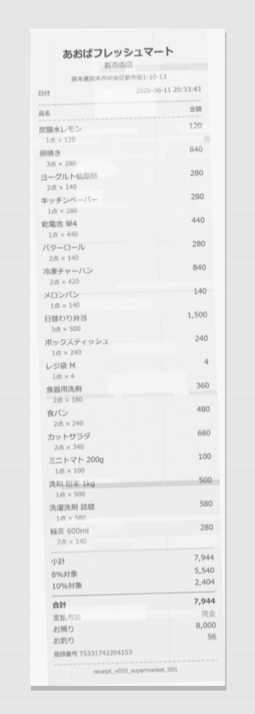

# Japan OCR Mini Benchmark

A small synthetic Japanese receipt OCR/VLM benchmark for testing document understanding models on noisy Japanese receipts.

## Current Dataset

The current public dataset payload is **v0.2.0**.

Use `release_v0.2.0/data/v0.2.0` as the canonical data root for v0.2.0.

Earlier 5-receipt sample materials are kept under `legacy/initial_5_receipt_sample/` for historical comparison. They are not the latest dataset payload.

## Sample Image

Example v0.2.0 noisy receipt image:



This sample comes from the v0.2.0 synthetic Japanese receipt target run and includes camera-like degradation such as print fading, local blur, thermal banding, resolution loss, shadow, and JPEG roundtrip compression.

## What Is Included

- Records: `20`
- Source JSON files: `20`
- Metadata JSON files: `20`
- Degradation metadata JSON files: `20`
- Clean PNG images: `20`
- Noisy PNG images: `20`
- Total item rows: `180`
- LLM-approved item rows: `56`
- Item-master rows: `124`

## Data Layout

```text
release_v0.2.0/data/v0.2.0/
  manifest.jsonl
  source_json/
  metadata/
  degradation_metadata/
  images_clean/
  images_noisy/
release_v0.2.0/reports/v0.2.0/
  v020_target_run_summary.json
  v020_target_run_validation_latest.json
  v020_target_run_validation_latest.csv
  v020_review_full_step147.csv
  v020_review_shortlist_step147.csv
legacy/initial_5_receipt_sample/
  eval/
  ground_truth/
  images/
  model_outputs/
  notes/
  README.md
```

## Manifest

`manifest.jsonl` is the easiest entry point for programmatic use. Each line is one JSON object with:

- `document_id`
- `template_id`
- `clean_image`
- `noisy_image`
- `source_json`
- `metadata_json`
- `degradation_metadata`
- `noisy_profile`
- `item_count`
- `llm_item_count`
- `total`

The file paths inside `manifest.jsonl` are relative to `release_v0.2.0/data/v0.2.0`.

## Template Coverage

| Template | Records | Noisy profiles |
| --- | ---: | --- |
| `bakery_simple` | 2 | medium=2 |
| `cafe_small_receipt` | 2 | medium=2 |
| `convenience_store_standard` | 3 | light=3 |
| `drugstore_mixed_tax` | 3 | medium=3 |
| `parking_machine` | 1 | hard=1 |
| `restaurant_receipt` | 2 | medium=2 |
| `station_store_narrow` | 4 | hard=4 |
| `supermarket_long` | 3 | hard=3 |

## Data Policy

All receipt images and JSON files are synthetic.

This project does not include real receipts, real store data, real customer data, personal information, or real transaction records. Store names, addresses, invoice numbers, receipt contents, and transaction details are fictional test data.


## Quick Start

Read `manifest.jsonl` and resolve each artifact path relative to `release_v0.2.0/data/v0.2.0`:

```python
from pathlib import Path
import json

data_root = Path("release_v0.2.0/data/v0.2.0")
manifest_path = data_root / "manifest.jsonl"

with manifest_path.open("r", encoding="utf-8") as f:
    first = json.loads(next(f))

print(first["document_id"])
print(data_root / first["noisy_image"])
print(data_root / first["source_json"])
```

<!-- JOMB_V020_RELEASE_CANDIDATE_START -->
<!-- This block summarizes the published v0.2.0 payload frozen from the release candidate artifacts. -->
<!-- Edit the source release notes or refresh script if regeneration is needed. -->

## v0.2.0 Release Payload

The v0.2.0 payload is the current public dataset release for OCR/VLM evaluation on synthetic Japanese receipts.

### Contents

- Records: `20`
- Successful records: `20`
- Failed records: `0`
- Modalities: source JSON, metadata JSON, degradation metadata, clean PNG images, noisy PNG images, validation outputs, and human-review reports.
- Receipt styles: convenience store, supermarket, drugstore, bakery, station-store narrow receipts, restaurant receipts, parking payment-machine receipts, and cafe receipts.

### Item Generation

- Generation method: hybrid deterministic item master plus validated LLM-approved item pool.
- Documents with LLM-approved items: `19`
- LLM-approved item count: `56`
- Item-master item count: `124`
- LLM mix ratio: `0.3111`

### Noisy Rendering

- Noisy images use strengthened camera-like degradation profiles.
- Effects include resolution loss, thermal banding, print fading, stroke-level kasure, local blur, lighting unevenness, rotation, camera canvas, shadow, and JPEG roundtrip compression.
- Noisy profile counts: `{'light': 3, 'medium': 9, 'hard': 8}`

### Validation

- Validation status: `warning`
- Validation status counts: `{'ok': 8, 'warning': 12}`
- Issue code top counts: `{'clean_noisy_size_large_difference': 12}`

The remaining validation warning, `clean_noisy_size_large_difference`, is expected because noisy images include stronger camera-like framing and degradation.

### Release Status

- Published payload version: `v0.2.0`
- Frozen target run ID: `v020_target_20260613_221713`
- Manual visual review: `ok_by_user_step148`

<!-- JOMB_V020_RELEASE_CANDIDATE_END -->

## Notes for Earlier Materials

The earlier 5-receipt mini sample is preserved at `legacy/initial_5_receipt_sample/`. For new work, start from `release_v0.2.0/data/v0.2.0/manifest.jsonl`.
