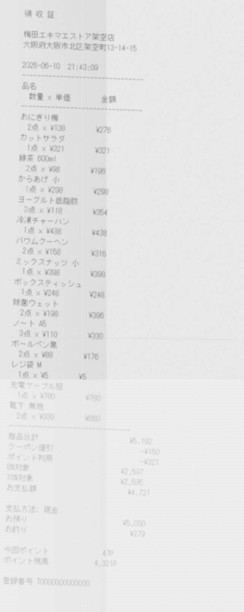

\# Japan OCR Mini Benchmark

## Sample image

Example noisy receipt image used in this benchmark:



This sample is intentionally degraded with blur, fading, shadow, narrow layout, quantity/unit-price columns, discounts, point usage, and similar-looking numeric fields.

## Quick start

Download the latest release ZIP from the GitHub Releases page:

`japan_ocr_mini_benchmark_release_sample_final.zip`

After extracting the ZIP, run the evaluation script:

```powershell
python .\eval\compare_receipt_items.py receipt_005
```

The script compares the model output JSON against the ground-truth JSON and reports `[OK]` or `[NG]` for each field.

`receipt_005_noisy.png` is the current hardest sample. It includes a narrow layout, quantity and unit price columns, coupon discount, point usage, tax target fields, final payment amount, cash received, and change.


A small synthetic Japanese receipt OCR/VLM benchmark for testing document understanding models on noisy Japanese receipts.


This project contains synthetic Japanese receipt images, ground-truth JSON files, model output JSON files, comparison scripts, and failure case notes.


\## Purpose


The goal of this benchmark is to test whether OCR and vision-language models can accurately extract structured data from Japanese receipt images.


The dataset focuses on Japanese-specific receipt challenges such as:


\* Japanese store names

\* Japanese item names

\* mixed food and daily goods items

\* 8% and 10% tax target amounts

\* discounts

\* point usage

\* cash received and change

\* narrow receipt layouts

\* quantity and unit price columns

\* blurred, rotated, faded, and noisy receipt images

\* dakuten and handakuten recognition errors


\## Dataset status


This is an early experimental mini benchmark.


Current sample set:


| Document ID | Description                                                             | Difficulty     |

| ----------- | ----------------------------------------------------------------------- | -------------- |

| receipt\_001 | Convenience-store-style receipt                                         | Easy           |

| receipt\_002 | Drugstore-style receipt                                                 | Easy to Medium |

| receipt\_003 | Bakery-style receipt with stronger noise                                | Medium         |

| receipt\_004 | Supermarket-style receipt with discount and points                      | Medium to Hard |

| receipt\_005 | Narrow station-store-style receipt with quantity and unit price columns | Hard           |


\## Directory structure


```text

japan\_ocr\_mini\_benchmark/

├── 01\_source\_json/

│   ├── receipt\_001\_source.json

│   ├── receipt\_002\_source.json

│   ├── receipt\_003\_source.json

│   ├── receipt\_004\_source.json

│   └── receipt\_005\_source.json

│

├── 02\_receipt\_images/

│   ├── receipt\_001.png

│   ├── receipt\_001\_noisy.png

│   ├── receipt\_002.png

│   ├── receipt\_002\_noisy.png

│   ├── receipt\_003.png

│   ├── receipt\_003\_noisy.png

│   ├── receipt\_004.png

│   ├── receipt\_004\_noisy.png

│   ├── receipt\_005.png

│   └── receipt\_005\_noisy.png

│

├── 03\_ground\_truth/

│   ├── receipt\_001\_ground\_truth.json

│   ├── receipt\_002\_ground\_truth.json

│   ├── receipt\_003\_ground\_truth.json

│   ├── receipt\_004\_ground\_truth.json

│   └── receipt\_005\_ground\_truth.json

│

├── 04\_eval/

│   ├── generate\_receipt\_image.py

│   ├── make\_noisy\_receipt.py

│   ├── compare\_receipt\_result.py

│   ├── compare\_receipt\_items.py

│   ├── receipt\_001\_ocr\_output.json

│   ├── receipt\_002\_ocr\_output.json

│   ├── receipt\_002\_ocr\_output\_items.json

│   ├── receipt\_003\_ocr\_output\_items.json

│   ├── receipt\_004\_ocr\_output\_items.json

│   └── receipt\_005\_ocr\_output\_items.json

│

├── 99\_notes/

│   ├── experiment\_log.md

│   └── failure\_cases.md

│

└── README.md

```


\## Data policy


All receipt images and JSON files are synthetic.


This project does not include:


\* real receipts

\* real store data

\* real company data

\* real customer data

\* personal information

\* real transaction records


All store names, addresses, invoice numbers, receipt contents, and transaction details are fictional.


\## Ground truth format


Each receipt has a ground-truth JSON file.


Example fields:


```json

{

&#x20; "document\_id": "receipt\_005",

&#x20; "image\_file": "receipt\_005\_noisy.png",

&#x20; "document\_type": "receipt",

&#x20; "store\_name": "梅田エキマエストア架空店",

&#x20; "date": "2026-06-10",

&#x20; "time": "21:43:09",

&#x20; "items": \[

&#x20;   {

&#x20;     "name": "おにぎり梅",

&#x20;     "quantity": 2,

&#x20;     "unit\_price": 138,

&#x20;     "amount": 276,

&#x20;     "tax\_rate": 8

&#x20;   }

&#x20; ],

&#x20; "subtotal": 5192,

&#x20; "coupon\_discount": 150,

&#x20; "points\_used": 321,

&#x20; "tax\_8\_target": 2597,

&#x20; "tax\_10\_target": 2595,

&#x20; "total": 4721,

&#x20; "payment\_method": "現金",

&#x20; "cash\_received": 5000,

&#x20; "change": 279,

&#x20; "points\_earned": 47,

&#x20; "point\_balance": 4321

}

```


\## Evaluation


The project includes a simple comparison script.


Example:


```powershell

python .\\04\_eval\\compare\_receipt\_items.py receipt\_005

```


The script compares model output JSON against ground-truth JSON and reports `\[OK]` or `\[NG]` for each field.


\## Initial model test


Initial tests were performed using Qwen3.6 35B A3B.


Qwen3.6 35B A3B successfully extracted all tested fields from receipt\_001 through receipt\_004.


In receipt\_005, the model produced several measurable errors.


\## Example failure case


For `receipt\_005\_noisy.png`, Qwen3.6 35B A3B made the following errors:


| Field         | Ground truth | Model output |

| ------------- | -----------: | -----------: |

| tax\_8\_target  |         2597 |         2607 |

| tax\_10\_target |         2595 |         2605 |


It also made Japanese item name errors:


| Ground truth | Model output |

| ------------ | ------------ |

| バウムクーヘン      | パウムクーヘン      |

| ボックスティッシュ    | ポックスティッシュ    |


These errors suggest that degraded Japanese receipt images can cause:


\* small numerical extraction errors

\* Japanese dakuten / handakuten recognition errors

\* confusion in dense receipt sections


\## Notes


This is not a tax, accounting, or compliance dataset.


This benchmark is intended for OCR/VLM testing, prompt testing, model comparison, and document AI experimentation.


\## Future work


Planned additions:


\* more receipt layouts

\* stronger thermal printer fading

\* handwritten notes

\* cropped totals

\* duplicate subtotal and total fields

\* tax-included and tax-excluded mixed notation

\* actual tax amount fields

\* receipts with stamps

\* receipts with perspective distortion

\* multilingual Japanese/English mixed receipts


## License and usage notice

Please see `LICENSE.md` for usage terms, synthetic data notice, warranty disclaimer, and attribution guidance.
