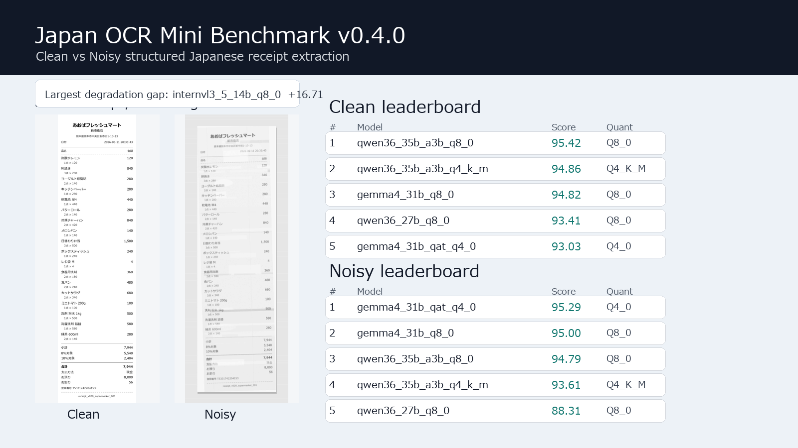

# Japan OCR Mini Benchmark

A compact Japanese receipt OCR/VLM benchmark with noisy synthetic receipt images, ground-truth JSON, and local LM Studio baseline results.



## Why This Exists

Most OCR examples stop at "can the model read the text?" This benchmark checks whether a model can recover structured Japanese receipt data:

- receipt-level fields: store, branch, address, date, time, payment, tax, total
- item-level fields: product name, quantity, unit price, line amount
- noisy camera-like inputs: print fading, local blur, banding, shadow, rotation, JPEG compression
- synthetic-only data: no real customer receipts, no personal information

It is intentionally small, inspectable, and easy to run locally. That makes it useful for fast OCR/VLM smoke tests before you spend time or money on larger evaluations.

## Current Releases

- **Dataset payload:** `v0.2.0`
- **Official LM Studio baseline:** `v0.3.0`
- **Operational result snapshots:** `v0.3.1`, `v0.3.2`
- **Clean/Noisy benchmark release:** `v0.4.0`
- **Reference generator audit snapshot:** `v0.4.1`
- **Canonical data root:** `release_v0.2.0/data/v0.2.0`
- **Official reports:** `reports/v0.3.0`, `reports/v0.3.1`, `reports/v0.3.2`, `reports/v0.4.0`, and `reports/reference_generation/v0.4.1`

<!-- JOMB_V030_LMSTUDIO_BASELINE_START -->
## v0.4.0 Clean and Noisy LM Studio Benchmarks

The tables below use the same frozen `v0.2.0` synthetic receipt dataset and the same `JOMB Core Score v1` formula. Clean images measure structured extraction on controlled renders. Noisy images are the main stress test with camera-like degradation.

### JOMB Core Score v1

`Core Score / 100 = Exact * 10 + Top-level * 25 + Item fields * 50 + Item count * 15`

The score is quality-only. Runtime is reported separately and is not part of the rank.

### Clean Image Benchmark

- Source: `reports/v0.4.0/clean_leaderboard.json`
- Generated: `2026-06-17T06:24:51.021483+00:00`
- Image variant: `clean`
- Records per model: `20`

| Rank | Model | Core /100 | Quant | Completed | Avg sec | Exact | Top-level | Item fields | Item count |
| ---: | --- | ---: | --- | ---: | ---: | ---: | ---: | ---: | ---: |
| 1 | `qwen36_35b_a3b_q8_0` | 95.42 | `Q8_0` | 20/20 | 5.78 | 0.6 | 0.979545 | 0.998611 | 1 |
| 2 | `qwen36_35b_a3b_q4_k_m` | 94.86 | `Q4_K_M` | 20/20 | 5.149 | 0.55 | 0.977273 | 0.998611 | 1 |
| 3 | `gemma4_31b_q8_0` | 94.82 | `Q8_0` | 20/20 | 55.076 | 0.55 | 0.972727 | 1 | 1 |
| 4 | `qwen36_27b_q8_0` | 93.41 | `Q8_0` | 20/20 | 17.891 | 0.65 | 0.993182 | 0.941667 | 1 |
| 5 | `gemma4_31b_qat_q4_0` | 93.03 | `Q4_0` | 20/20 | 35.239 | 0.45 | 0.977273 | 0.981944 | 1 |
| 6 | `qwen3_vl_30b_q4_k_m` | 75.38 | `Q4_K_M` | 20/20 | 2.539 | 0.15 | 0.963636 | 0.695833 | 1 |
| 7 | `internvl3_5_14b_q8_0` | 72.87 | `Q8_0` | 20/20 | 9.598 | 0.15 | 0.895455 | 0.709722 | 0.9 |
| 8 | `qwen25_vl_7b_q8_0` | 71.88 | `Q8_0` | 20/20 | 5.447 | 0 | 0.936364 | 0.669444 | 1 |
| 9 | `gemma4_26b_a4b_qat_q4_0` | 68.95 | `Q4_0` | 16/20 | 14.119 | 0.15 | 0.856818 | 0.680685 | 0.8 |

### Noisy Image Benchmark

- Source: `reports/v0.4.0/noisy_leaderboard.json`
- Image variant: `noisy`
- Records per model: `20`

| Rank | Run | Model | Core /100 | Quant | Completed | Avg sec | Exact | Top-level | Item fields | Item count |
| ---: | --- | --- | ---: | --- | ---: | ---: | ---: | ---: | ---: | ---: |
| 1 | `v0.3.1` | `gemma4_31b_qat_q4_0` | 95.29 | `Q4_0` | 20/20 | 35.128 | 0.6 | 0.977273 | 0.997222 | 1 |
| 2 | `v0.3.0` | `gemma4_31b_q8_0` | 95.00 | `Q8_0` | 20/20 | 53.195 | 0.6 | 0.979545 | 0.990278 | 1 |
| 3 | `v0.3.2` | `qwen36_35b_a3b_q8_0` | 94.79 | `Q8_0` | 20/20 | 4.633 | 0.55 | 0.977273 | 0.997222 | 1 |
| 4 | `v0.3.0` | `qwen36_35b_a3b_q4_k_m` | 93.61 | `Q4_K_M` | 20/20 | 4.282 | 0.45 | 0.972727 | 0.995833 | 1 |
| 5 | `v0.3.1` | `qwen36_27b_q8_0` | 88.31 | `Q8_0` | 20/20 | 17.754 | 0.5 | 0.979545 | 0.876389 | 1 |
| 6 | `v0.3.0` | `qwen3_vl_30b_q4_k_m` | 73.59 | `Q4_K_M` | 20/20 | 3.248 | 0.05 | 0.943182 | 0.690278 | 1 |
| 7 | `v0.3.0` | `qwen25_vl_7b_q8_0` | 70.99 | `Q8_0` | 20/20 | 5.094 | 0 | 0.934091 | 0.652778 | 1 |
| 8 | `v0.3.1` | `gemma4_26b_a4b_qat_q4_0` | 64.22 | `Q4_0` | 17/20 | 15.236 | 0.2 | 0.797727 | 0.635621 | 0.7 |
| 9 | `v0.3.0` | `internvl3_5_14b_q8_0` | 56.16 | `Q8_0` | 20/20 | 9.519 | 0 | 0.725 | 0.565672 | 0.65 |

### Paired Clean vs Noisy

| Clean Rank | Model | Clean /100 | Noisy /100 | Delta | Quant | Clean Avg sec | Noisy Avg sec |
| ---: | --- | ---: | ---: | ---: | --- | ---: | ---: |
| 1 | `qwen36_35b_a3b_q8_0` | 95.42 | 94.79 | 0.63 | `Q8_0` | 5.78 | 4.633 |
| 2 | `qwen36_35b_a3b_q4_k_m` | 94.86 | 93.61 | 1.25 | `Q4_K_M` | 5.149 | 4.282 |
| 3 | `gemma4_31b_q8_0` | 94.82 | 95.00 | -0.18 | `Q8_0` | 55.076 | 53.195 |
| 4 | `qwen36_27b_q8_0` | 93.41 | 88.31 | 5.1 | `Q8_0` | 17.891 | 17.754 |
| 5 | `gemma4_31b_qat_q4_0` | 93.03 | 95.29 | -2.26 | `Q4_0` | 35.239 | 35.128 |
| 6 | `qwen3_vl_30b_q4_k_m` | 75.38 | 73.59 | 1.79 | `Q4_K_M` | 2.539 | 3.248 |
| 7 | `internvl3_5_14b_q8_0` | 72.87 | 56.16 | 16.71 | `Q8_0` | 9.598 | 9.519 |
| 8 | `qwen25_vl_7b_q8_0` | 71.88 | 70.99 | 0.89 | `Q8_0` | 5.447 | 5.094 |
| 9 | `gemma4_26b_a4b_qat_q4_0` | 68.95 | 64.22 | 4.73 | `Q4_0` | 14.119 | 15.236 |

### Quick Takeaways

- Best clean score: `qwen36_35b_a3b_q8_0` at `95.42` / 100.
- Best noisy score: `gemma4_31b_qat_q4_0` at `95.29` / 100.
- Largest clean-over-noisy gap in the paired rows: `internvl3_5_14b_q8_0` at `16.71` points.
- A high clean score with a much lower noisy score is useful signal: it suggests the model understands the receipt structure but is sensitive to real-world image degradation.

<!-- JOMB_V030_LMSTUDIO_BASELINE_END -->

<!-- JOMB_V031_LEADERBOARD_START -->
## Leaderboard and Scoring

v0.4.0 publishes separate Clean and Noisy image leaderboards. The Clean leader is `qwen36_35b_a3b_q8_0` at `95.42` / 100, and the Noisy leader is `gemma4_31b_qat_q4_0` at `95.29` / 100.

- Leaderboard: `LEADERBOARD.md`
- v0.4.0 reports: `reports/v0.4.0`
- Score protocol: `docs/evaluation/jomb_core_score_v1.md`
- Evaluate your own model: `docs/evaluation/submit_model_results.md`

Use this when you want to compare a new OCR/VLM run against both clean-render and noisy-image local LM Studio baselines.
<!-- JOMB_V031_LEADERBOARD_END -->

## Reference Receipt Generator Audit

`v0.4.1` adds a public-quality audit snapshot for the reference-derived synthetic receipt generator. It is separate from the frozen benchmark payload: the goal is to prove that the growing receipt-template library can generate varied, fictional clean receipts without obvious item-line integrity problems.

- Report: `reports/reference_generation/v0.4.1`
- Review page: `reports/reference_generation/v0.4.1/index.html`
- Contact sheet: `reports/reference_generation/v0.4.1/contact_sheet.png`
- Audit summary: `reports/reference_generation/v0.4.1/duplicate_audit_summary.json`
- Release note: `docs/releases/v0.4.1.md`

Latest audited snapshot: `23` synthetic receipt templates, `118` item/service semantic lines, `0` normal item amount-missing errors, `0` invalid 0-yen item errors, and `0` exact name + quantity + amount duplicates.

## What You Get

```text
release_v0.2.0/data/v0.2.0/
  manifest.jsonl
  source_json/
  metadata/
  degradation_metadata/
  images_clean/
  images_noisy/
reports/v0.3.0/
  v030_lmstudio_5model_summary.json
  v030_lmstudio_5model_summary.csv
  v030_lmstudio_5model_summary.md
reports/v0.3.1/
  v031_operational_20image_summary.json
  v031_operational_20image_summary.csv
  v031_operational_20image_summary.md
  leaderboard.json
  leaderboard.csv
  leaderboard.md
reports/v0.3.2/
  v032_qwen36_35b_a3b_q8_0_summary.json
  v032_qwen36_35b_a3b_q8_0_summary.csv
  v032_qwen36_35b_a3b_q8_0_summary.md
  leaderboard.json
  leaderboard.csv
  leaderboard.md
reports/v0.4.0/
  clean_leaderboard.json
  clean_leaderboard.csv
  clean_leaderboard.md
  noisy_leaderboard.json
  noisy_leaderboard.csv
  noisy_leaderboard.md
  clean_noisy_paired_leaderboard.json
  clean_noisy_paired_leaderboard.csv
  clean_noisy_paired_leaderboard.md
reports/reference_generation/v0.4.1/
  README.md
  index.html
  contact_sheet.png
  duplicate_audit.html
  duplicate_audit_summary.json
  item_line_duplicate_audit.csv
  manifest.jsonl
  summary.json
  images_clean/
  metadata/
docs/releases/v0.3.0.md
docs/releases/v0.3.1.md
docs/releases/v0.3.2.md
docs/releases/v0.4.0.md
docs/releases/v0.4.1.md
docs/usage/reference_receipt_fictionalization_recipe.md
LEADERBOARD.md
assets/jomb_v030_showcase.png
assets/samples/reference_style_fictional_receipt_photo.png
```

## Quick Start

List a few records from the manifest:

```powershell
python examples/load_v020_manifest.py --data-root "release_v0.2.0\data\v0.2.0" --limit 5 --show-paths
```

Evaluate your own prediction JSON files:

```powershell
python examples/evaluate_v020_baseline.py --data-root "release_v0.2.0\data\v0.2.0" --prediction-dir ".\model_outputs\my-model"
```

Read the manifest directly:

```python
from pathlib import Path
import json

data_root = Path("release_v0.2.0/data/v0.2.0")
manifest_path = data_root / "manifest.jsonl"

with manifest_path.open("r", encoding="utf-8") as f:
    first = json.loads(next(f))

print(first["document_id"])
print(data_root / first["noisy_image"])
print(data_root / first["source_json"])
```

## Template Coverage

| Template | Records | Noisy profiles |
| --- | ---: | --- |
| `bakery_simple` | 2 | medium=2 |
| `cafe_small_receipt` | 2 | medium=2 |
| `convenience_store_standard` | 3 | light=3 |
| `drugstore_mixed_tax` | 3 | medium=3 |
| `parking_machine` | 1 | hard=1 |
| `restaurant_receipt` | 2 | medium=2 |
| `station_store_narrow` | 4 | hard=4 |
| `supermarket_long` | 3 | hard=3 |

## Data Policy

All receipt images and JSON files are synthetic. Store names, branch names, addresses, invoice numbers, dates, products, prices, totals, and transaction details are artificial test data.

Real receipt photos may be used as private visual references for future template design, but only at the high-level layout/degradation level. The public dataset must contain fictional synthetic outputs, not the original real receipt photos or copied brand text. See `docs/usage/reference_receipt_fictionalization_recipe.md`.

<!-- JOMB_V020_RELEASE_CANDIDATE_START -->
## v0.2.0 Dataset Payload

The v0.2.0 payload is the frozen public dataset release used by the v0.3.0 LM Studio baseline.

- Records: `20`
- Source JSON files: `20`
- Metadata JSON files: `20`
- Degradation metadata JSON files: `20`
- Clean PNG images: `20`
- Noisy PNG images: `20`
- Total item rows: `180`
- Noisy profile counts: `light=3`, `medium=9`, `hard=8`
- Frozen target run ID: `v020_target_20260613_221713`
- Data root: `release_v0.2.0/data/v0.2.0`
- Reports root: `reports/v0.2.0`

All receipt images and JSON files are synthetic. No real customer receipt data is included.
<!-- JOMB_V020_RELEASE_CANDIDATE_END -->


## Notes

Earlier 5-receipt sample materials are preserved at `legacy/initial_5_receipt_sample/`. For current work, start from `manifest.jsonl` in the v0.2.0 data root.
